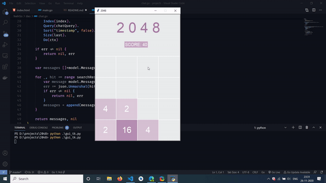

This repository contains code for a Python implementation for 2048.

The code is divided into 2 main parts:

1. `gui_tk.py` which is the entrypoint of the application. 
2. `game.py` file which contains the code for the basic game mechanics.

A walkthrough of the game:
